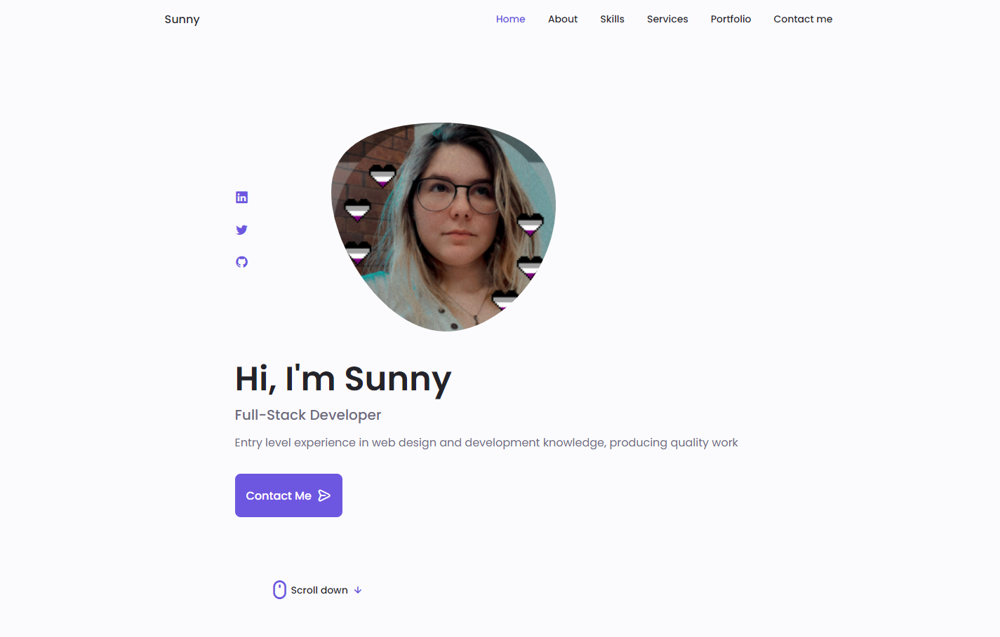

# Portfolio Renewed
## Table of Contents
- [General](#general)
- [Acceptance Criteria](#acceptance-criteria)
- [Inspiration](#inspiration)
- [Screenshots](#screenshot)
- [Technology Used](#technology-used)
- [Status](#status)
- [Authors](#authors)
- [License](#license)

## General
This project was built in order to begin preparing my professional portfolio. As I progress as a coder and developer, I will be adding and changing the overall design to accommodate new knowledge and skills.
- [Github](https://github.com/laurenagra/Portfolio)
- [Deployed Application](https://laurenagra.github.io/Portfolio/)

## Acceptance Criteria 
Your updated portfolio should:

1. Display your contact information. If you don't want to share your personal email or phone number, use a separate email that you will only use for coding, also known as a developer email, and/or a call forwarding service, such as Google Voice.

2. Have links to your GitHub profile and LinkedIn profile

3. Have a link to a downloadable PDF of your resume

4. Display at least 3 examples of student work from either deployed projects or homeworks. For each project, make sure you have the following:

5. Project title

6. Link to the deployed version

7. Link to the GitHub repository

8. Screenshot of the deployed application

9. Have a polished, mobile-responsive user interface.

## Inspiration
To tackle this one, I really wanted to try giving it a new design. I'm still working through the kinks of my media query and design skills, so I found some existing code that I could use for my base and filled in my information where needed, adjusting queries and certain pieces of code as needed. 
- Bedimcode for Base Structure

## Screenshot

## Technology Used

- With this one, I focused pretty heavily on front end content. It's nice to have learned backend, but I personally prefer to focus on UI/UX/Design
- 
- 
- 

## Status 
- This project is complete as of April 30th

## Authors
Lauren Agra
 - [LinkedIn](https://www.linkedin.com/in/lauren-agra-aa868b1b8/)
 - [Github](https://github.com/laurenagra)

 ## License
 - 